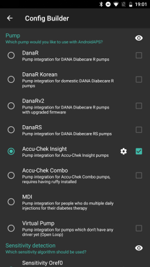
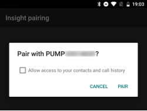
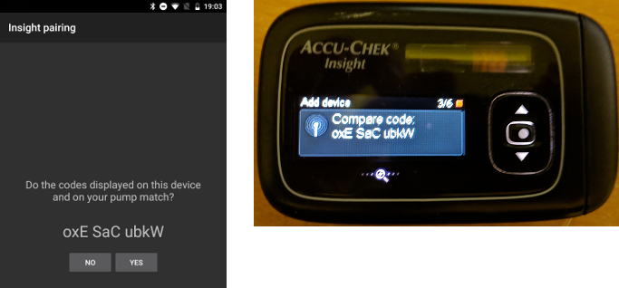
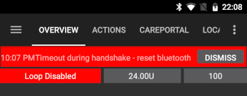

# Pumpa Accu-Chek Insight

**Tento software je součástí DIY řešení umělé slinivky, nejedná se o výrobek. Před jeho používáním je důležité, abyste prostudovali a pochopili celý systém, včetně toho jak ho používat. Není to něco, co za Vás udělá veškerý management diabetu. Pokud do toho investujete potřebný čas, pomůže Vám dojít k lepším výsledkům při léčbě Vaší cukrovky, a tím zlepšit i kvalitu Vašeho života. Zbytečně nespěchejte, a vytvořte si čas pro učení. Pouze Vy jste zodpovědní za ovládání Vašeho systému.**

* * *

## ***UPOZORNĚNÍ:** Pokud jste v minulosti používali pumpu Insight s ovladačem **SightRemote**, prosím **odinstalujte SightRemote** a **aktualizujte na verzi 2.1**.*

## Hardwarové a softwarové požadavky

* Pumpa Roche Accu-Chek Insight (jákýkoliv firmware, fungují všechny)   Poznámka: AAPS bude vždy zapisovat data do **prvního bazálního profilu v pumpě**
* Telefon s Androidem (v podstatě všechny verze Android budou fungovat, ale AndroidAPS sám o sobě vyžaduje alespoň Android 5 (Lollipop)).
* Aplikace AndroidAPS (minimálně v2.1) nainstalovaná ve vašem telefonu

## Nastavení

* Pumpa Insight by měla být připojena současně pouze k jednomu zařízení. Pokud jsme v minulosti používali dálkové ovládání pro Insight (glukometr), musíte zařízení odstranit ze seznamu spárovaných zařízení ve své pumpě: Menu > Nastavení > Komunikace > Odebrat zařízení
    
    

* V nabídce [Konfigurace](../Configuration/Config-Builder) aplikace AndroidAPS vyberte v sekci Pumpa možnost Accu-Chek Insight
    
    

* Chcete-li otevřít nabídku nastavení, klikněte na ozubené kolečko.

* V nastavení klikněte na tlačítko „Insight párování“ v horní části obrazovky. Měli byste vidět seznam bluetooth zařízení v dosahu (níže vlevo).
* V pumpě Insight jděte do Menu > Nastavení > Komunikace > Přidat zařízení. Pumpa zobrazí následující obrazovku (vpravo níže) zobrazující seriové číslo pumpy.
    
    

* Vezměte telefon a klikněte na sériové číslo pumpy v seznamu bluetooth zařízení v telefonu. Potvrďte kliknutím na Párování.
    
    

* Pumpa i telefon poté zobrazí na displeji kód. Zkontrolujte, jestli je na obou zařízeních shodný kód a potvrďte jej jak v pumpě, tak v telefonu.
    
    

* Úspěch! Můžete si poblahopřát, úspěšně jste spárovali pumpu s AndroidAPS.
    
    

* Chcete-li zkontrolovat, jestli je vše správně, jděte zpět do nabídky Konfigurace v AndroidAPS a klikněte na ozubené kolečko v nabídce Pumpa - Accu Chek Insight. Klikněte na Insight párování, kde uvidíte informace o pumpě:
    
    

Poznámka: Spojení mezi pumpou a telefonem není permanentní. Spojení bude navázáno pouze tehdy, je-li to nezbytné (např. při nastavování dočasného bazálu, posílání bolusu, čtení historie z pumpy apod.). V opačném případě by se baterie v pumpě i mobilu velmi rychle vybila.

## Nastavení v AAPS

V Insight nastavení v AndroidAPS můžete upravit následující možnosti:

* „Zaznamenat výměnu kanyly“: Automaticky provede záznam výměny kanyly, když v pumpě provedete „Naplnit kanylu“   
    Poznámka: Výměna kanyly také způsobí reset automatické citlivosti</b>
* „Zaznamenat výměnu hadičky“: Automaticky provede záznam v databázi AndroidAPS, když v pumpě provedete „Naplnit hadičku“.
* „Zaznamenat výměnu baterie“: Automaticky provede záznam výměny baterie, pokud vložíte do pumpy novou baterii.
* „Zaznamenat změnu režimu provozu“: Automaticky provede záznam v databázi AndroidAPS, kdykoliv spustíte/zastavíte pumpu.
* „Zaznamenat výstrahy“: Automaticky provede záznam v databázi AndroidAPS, kdykoliv pumpa zahlásí alarm (s výjimkou upomínek, bolusů a konce dočasných bazálů (TBR) – ty zaznamenány nejsou).
* „Povolit emulaci dočasných bazálů“: pumpa Insight umožňuje hodnotu maximálního dočasného bazálu (TBR) do výše 250 %. Aby bylo možné toto omezení obejít, pumpa obdrží příkaz provést prodloužený bolus, aby bylo možné zvýšit TBR nad 250 %. Pozn.: Současné používání prodlouženého bolusu ve stejný čas jako další prodloužený bolus může způsobit chybu.
* „Doba čekání na obnovení spojení“: Definuje, jak dlouho bude AndroidAPS čekat před opětovným pokusem po neúspěšném pokusu o připojení. Můžete vybrat 0 až 20 sekund. Pokud máte problémy s připojením, vyberte delší dobu čekání.   
      
    Příklad pro min. dobu trvání zotavení = 5 a max. dobu zotavení = 20   
      
    žádné spojení -> čekej **5** sec.   
    znovu -> žádné spojení -> čekej **6** sec.   
    znovu -> žádné spojení -> čekej **7** sec.   
    znovu -> žádné spojení -> čekej **8** sec.   
    ...   
    znovu -> žádné spojení -> čekej **20** sec.   
    znovu -> žádné spojení -> čekej **20** sec.   
    ...

* „Limit pro odpojení“: Definuje, jak dlouho (v sekundách) bude AndroidAPS čekat s odpojením od pumpy po dokončení úlohy. Výchozí hodnota je 5 sekund.

Po dobu, kdy byla pumpa zastavena, AAPS zobrazí záznam s dočasnou bazální hodnotou 0 %.

V AndroidAPS v záložce Accu-Chek Insight se zobrazuje aktuální stav pumpy a dvě tlačítka:

* „Obnovit“: Opětovné načtení statusu z pumpy
* „Povolit oznamování konce dočasného bazálu“: Standardně pumpa Insight spouští zvukový signál, když je TBR dokončen. Toto tlačítko vám umožňuje povolit nebo zakázat tento alarm, aniž byste museli použít software pro konfiguraci pumpy.
    
    

## Nastavení v pumpě

Nastavení alarmů v pumpě:

* Menu > Nastavení > Nastavení zařízení > Nastavení režimu > Tichý > Hlasitost > 0 (odeberte všechny sloupečky) > Nastavení > Nastavení zařízení > Nastavení režimu > Tichý > Signál > Vibrace
* Menu > Režimy > Režim signalizace > Tichý

To ztlumí všechny alarmy z pumpy, což umožní systému AndroidAPS rozhodnout, zda je pro vás alarm relevantní. Pokud alarm AndroidAPS nebude potvrzen, hlasitost alarmu se bude zvyšovat (nejprvé pípnutí, potom vibrace).

Pumpy Insight s novějším firmwarem budou vibrovat vždy při podání bolusu (například když AndroidAPS pošle SMB nebo emulace TBR vydá prodloužený bolus). Vibrace není možné vypnout. Starší pumpy za těchto okolností nevibrují.

## Výměna baterie

Pumpa Insight má malou interní baterii udržující základní funkce, jako jsou vnitřní hodiny, zatímco vyměňujete hlavní baterii. Pokud výměna baterie trvá příliš dlouho, tato interní baterie se může vybít, hodiny se resetují a vy budete vyzváni, abyste po vložení nové baterie opětovně nastavili čas. Pokud se tak stane, všechny položky v AndroidAPS provedené před výměnou baterie nebudou zahrnuty do kalkulací, jelikož nelze určit správný čas.

## Specifické chyba Insight

### Prodloužený bolus

Používejte vždy pouze jeden prodloužený bolus, protože používání více prodloužených bolusů současně může způsobit chyby.

### Časový limit

Někdy se může stát, že pumpa Insight neodpoví během navazování spojení. V takovém případě AAPS zobrazí následující zprávu "Timeout during handshake - reset bluetooth".

V tom případě na 10 sekund vypněte bluetooth v pumpě i telefonu a potom jej opět zapněte.

## Změna časových pásem s pumpou Insight

Více informací o cestování přes více časových pásem najdete v části [Jak se vypořádat s cestováním přes časová pásma?](../Usage/Timezone-traveling#insight).