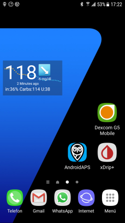
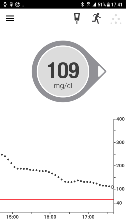
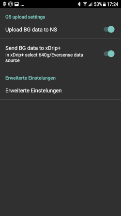
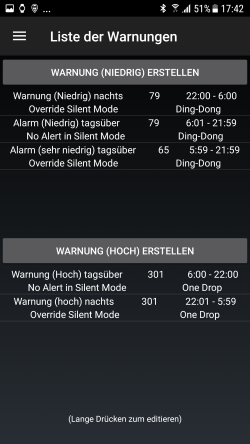
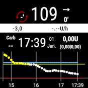

# Ukázka instalace: Samsung S7, DanaR, Dexcom G5 a Sony Smartwatch

## Popis

V tomto případě je k ovládání smyčky použit telefon Samsung Galaxy S7. Upravená aplikace Dexcom přijímá data ze senzoru Dexcom G5. AndroidAPS slouží k řízení inzulínové pumpy Dana R od korejského výrobce SOOIL přes bluetooth. Další zařízení nejsou vyžadována.

Protože Dexcom aplikace nabízí pouze omezené možnosti alarmů, použijeme open source aplikaci xDrip+, která umí nastavit kromě alarmů vysoké a nízké glykémie také další alarmy přizpůsobené individuálním požadavkům.

Hodinky s WearOS lze použít (v tomto příkladu Sony Smartwatch 3 (SWR50)), volitelně k zobrazení glykémie a hodnot AndroidAPS na vašem zápěstí. Hodinky lze dokonce použít k ovládání AndroidAPS (např. diskrétní poslání bolusu k jídlu).

Systém pracuje offline. To znamená, že pro ovládání není třeba datové připojení telefonu k internetu.

Nicméně, data se automaticky nahrají do Nightscoutu, jakmile je navázáno datové připojení. Nahráním dat do Nightscoutu získáte kompletní výkazy, které využijete například při návštěvě lékaře nebo můžete sdílet aktuální hodnoty s členy rodiny. Data do Nightscoutu (abyste mohli využívat různé Výkazy) lze také pouze prostřednictvím (předdefinovaného) Wi-Fi připojení.

## Požadované součásti

1. Samsung Galaxy S7
    
    * Alternativy: viz [seznam testovaných telefonů a hodinek](https://docs.google.com/spreadsheets/d/1gZAsN6f0gv6tkgy9EBsYl0BQNhna0RDqA9QGycAqCQc/edit#gid=698881435) pro AndroidAPS

2. inzulinová pumpa [DanaR](http://www.sooil.com/eng/product/) nebo Dana RS
    
    * Alternativy: 
    * [Accu-Chek Combo](../Configuration/Accu-Chek-Combo-Pump.md)
    * Další pumpy mohou být k dispozici v budoucnu, podrobnosti viz [budoucí možné ovladače pumpy ](Future-possible-Pump-Drivers.md).

3. [Dexcom G5](https://dexcom.com)
    
    * Alternativy: viz seznam možných [zdrojů glykémie](../Configuration/BG-Source.md)

4. Volitelné: Sony Smartwatch 3 (SWR50)
    
    * Alternativy: viz [seznam testovaných telefonů a hodinek](https://docs.google.com/spreadsheets/d/1gZAsN6f0gv6tkgy9EBsYl0BQNhna0RDqA9QGycAqCQc/edit#gid=698881435) pro AndroidAPS (OS musí být Wear OS)

## Příprava Nightscoutu

Podrobné [Nastavení Nightscoutu](../Installing-AndroidAPS/Nightscout.md)

## Nastavení počítače

Abyste byli schopni vytvořit aplikaci pro Android z volně dostupných otevřených zdrojových kódu AAPS, potřebujete Android Studio nainstalované na svém počítači nebo notebooku (Windows, Mac, Linux). Podrobné instrukce naleznete v části [Vytvoření APK](../Installing-AndroidAPS/Building-APK.md).

Při instalaci Android Studia buďte trpěliví, software potřebuje stáhnout spoustu dodatečných dat (balíčků) po nainstalovaní do počítače.

## Nastavení telefonu

### Zkontrolujte firmware telefonu

* Nabídka > Nastavení> Info o telefonu > Info o softwaru: Je potřeba alespoň „Android-verze 7.0“ (úspěšně testované do Android verze 8.0.0 Oreo - Samsung Experience verze 9.0) 
* Chcete-li aktualizovat firmware: Nabídka > Nastavení > Aktualizace softwaru

### Povolit instalaci aplikací z neznámých zdrojů

Nabídka > Nastavení> Zabezpečení > Neznámé zdroje > přepněte doprava (= aktivní)

Z bezpečnostních důvodů by toto nastavení mělo být nastaveno zpět na neaktivní po dokončení instalace všech aplikací, které jsou popsané zde.

### Zapněte Bluetooth

1. Nabídka > Nastavení > Připojení > Bluetooth > přepnout doprava (= aktivní)
2. Nabídka > Nastavení > Připojení > Umístění > přepnout doprava (= aktivní)

Služby určování polohy (dále jen „GPS“) musí být aktivovány, aby Bluetooth správně fungovalo.

### Nainstalujte aplikaci Dexcom (upravená verze)

Původní aplikace Dexcom z obchodu Google Play nebude fungovat, protože nevysílá hodnoty do jiné aplikace. Proto je vyžadována verze mírně upravená komunitou. Pouze tato upravená Dexcom aplikace může komunikovat s AAPS. Navíc lze použít upravenou Dexcom aplikaci se všemi Android telefony a ne jen s těmi v [seznamu kompatibilních zařízení s Dexcom](https://www.dexcom.com/dexcom-international-compatibility). Verze upravené aplikace Dexcom v mmol/l a mg/dl jsou k dispozici na https://github.com/dexcomapp/dexcomapp?files=1.

Chcete-li to provést, proveďte na svém smartphonu následující kroky:

1. Je-li původní Dexcom aplikace již nainstalována: 
    * Zastavte senzor
    * Odinstalujte aplikaci přes Nabídka > Nastavení > Aplikace > Dexcom G5 Mobile > odinstalovat
2. Stáhněte upravenou aplikaci Dexcom (zvolte si mg/dl nebo mmol/l dle svých potřeb) na: <https://github.com/dexcomapp/dexcomapp?files=1>
3. Nainstalujte upravenou aplikaci Dexcom do telefonu (= Vyberte stažený APK soubor)
4. Spusťte upravenou aplikaci Dexcom, aktivujte/kalibrujte senzor podle zobrazených pokynů a počkejte na dokončení fáze „zahřívání“.
5. Jakmile byly úspěšně vloženy první dvě kalibrace a upravená aplikace Dexcom ukazuje skutečné hodnoty glykémie, nastavte výstrahy (hamburger menu v horní levém rohu obrazovky) na následující: 
    * Urgentně nízká `55 mg/dl` / `3,1 mmol / l` (nelze vypnout)
    * Nízká `VYP`
    * Vysoká `VYP`
    * Tempo stoupání `VYP`
    * Tempo klesání `VYP`
    * Ztráta signálu `VYP`

## Nainstalujte AndroidAPS

1. Follow the instructions to [build the APK](../Installing-AndroidAPS/Building-APK#generate-signed-apk)
2. [Transfer](../Installing-AndroidAPS/Building-APK#transfer-apk-to-smartphone) the generated APK to your phone
3. [Nakonfigurujte AndroidAPS ](../Configuration/Config-Builder.md) podle svých potřeb pomocí průvodce nastavením nebo ručně
4. V tomto vzorovém nastavení jsme (mimo jiné) použili

* BG source: `Dexcom G5 App (patched)` -- click cock-wheel and activate `Upload BG data to NS` and `Send BG data to xDrip+` (see [BG source](../Configuration/BG-Source.md)

* NS Client activated (see [NS Client](../Configuration/Config-Builder#ns-profile) and [Nightscout setup](../Installing-AndroidAPS/Nightscout.md))

## Nainstalujte xDrip+

xDrip+ je další vyspělá open source aplikace, která nabízí bezpočet možností. V tomto nastavení se Xdrip+ nepoužívá jako zdroj glykémie z Dexcom G5 (což je v rozporu s tím, proč vývojáři vytvořili Xdrip+), ale pouze kvůli výstrahám a zobrazovaní aktuální hodnoty glykémie včetně její křivky ve widgetu na domovské obrazovce zařízení s Androidem. V aplikaci xDrip + lze výstrahy nastavit mnohem podrobněji než v aplikaci Dexcom, AAPS nebo Nightscout (žádné omezení ve výběru zvuků, různé alarmy podle denní doby atd.).

1. Stáhněte si nejnovější stabilní verzi aplikace xDrip+ (APK) do svého telefonu <https://xdrip-plus-updates.appspot.com/stable/xdrip-plus-latest.apk> - ne verze z Google Play!
2. Nainstalujte xDrip+ ze staženého souboru APK.
3. Spusťte xDrip + a proveďte následující nastavení (hamburger menu vlevo nahoře) 
    * Nastavení > Výstrahy a Upozornění > Seznam výstrah glykémií > Vytvořte výstrahy (vysoké a nízké) podle svých potřeb. 
    * Vytvořenou výstrahu lze změnit tak, že ji stisknete a dlouze přidržíte.
    * Nastavení > Výstrahy a Upozornění > Výstrahy kalibrace: vypnout (Připomínáno prostřednictvím upravené Dexcom aplikace)
    * Nastavení > Zdroj dat > 640G/EverSense
    * Nastavení > Komunikace mezi aplikacemi > Přijímat kalibrace > `ZAP`
    * Menu > Spustit senzor (je pouze „pro forma“ a nemá nic společného s běžícím senzorem G5. (To je nezbytné, jinak se bude pravidelně objevovat chybová zpráva.) 

### Příklad nastavení výstrahy

„Urgentní nízká výstraha“ (pod 55 mg/dl resp. 3,1 mmol) je standardní výstraha z upravené aplikace Dexcom, kterou nelze zakázat.

Tip pro schůzky / návštěvy kostela / kino atd.:

Je-li na Samsungu Galaxy S7 (Nastavení > Zvuky a vibrace > Nerušit: posuvník na pravé straně (= aktivní)) aktivován režim „Nerušit“, telefon jen vibruje při urgentní nízké výstraze a nevydává zvukové upozornění. Pro ostatní výstrahy vytvořené přes xDrip+ můžete vybrat, zda má výstraha ignorovat tichý režim telefonu (aby zazněl zvuk) nebo ne.

## Zakažte možnost pro úsporu energie

Na Samsungu Galaxy S7 přejděte do Menu > Nastavení > Údržba zařízení > Baterie > Nemonitorované aplikace > + Přidat aplikace: Vyberte postupně aplikace AndroidAPS, Dexcom G5 Mobile, xDrip + a Android Wear (pokud používáte hodinky)

## Volitelné: Sony Smartwatch 3 (SWR50)

S hodinkami s Wear OS může být život s diabetem ještě nenápadnější. Hodinky lze použít k zobrazení aktuální glykémie, stavu smyčky atd. na zápěstí. Hodinky lze dokonce použít k ovládání AndroidAPS (např. spustit bolus k jídlu). Chcete-li vydat bolus, dvakrát klepněte na hodnotu glykémie na ciferníku AAPSv2. Hodinky SWR50 obvykle vydrží na jedno nabití fungovat celý den (používají stejnou nabíječku jako Samsung Galaxy S7: microUSB).

Podrobnosti o informacích zobrazených na ciferníku hodinek najdete [zde](../Configuration/Watchfaces.md).

* Nainstalujte si aplikaci „Wear OS" do svého smartphonu přes Google Play a připojte hodinky podle uvedených pokynů.
* V AAPS zvolte hamburger menu (levý horní roh) > Konfigurace > Obecné (v dolní části seznamu) > Wear > Aktivovat na levé straně, klepněte na ozubené kolečko > Nastavení hodinek a aktivujte možnost `Řízení z hodinek Wear`
* Na hodinkách: chcete-li změnit ciferník, dlouze podržte displej hodinek a vyberte `AAPSv2`
* V případě potřeby restartujte obě zařízení.

## Nastavení pumpy

viz [Pumpa DanaR](../Configuration/DanaR-Insulin-Pump.md)