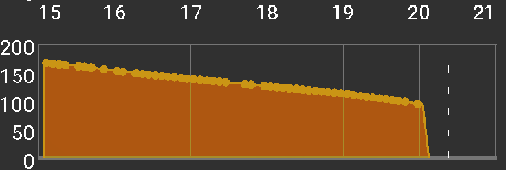

# Empfindlichkeitserkennung

## Sensitivitäts-Algorithmus

Aktuell gibt es drei Modelle zur Empfindlichkeitserkennung:

* Sensitivität Oref0
* Sensitivität AAPS
* Durchschnittliche Sensitivität
* Sensitivität Oref1

### Sensitivity Oref0

Grundsätzlich wird die Sensitivität auf Basis der Daten der vorangegangenen 24 Stunden berechnet. Kohlenhydrate (falls noch nicht absorbiert) werden nach einer bestimmten Zeit, die man einstellen kann, einfach abgeschnitten. Der Algorithmus ähnelt OpenAPS Oref0, beschrieben in der [OpenAPS Oref0 Dokumentation](https://openaps.readthedocs.io/en/2017-05-21/docs/walkthrough/phase-4/advanced-features.html).

### Sensitivity AAPS

Die Empfindlichkeit wird wie bei Oref0 berechnet, aber du kannst einstellen wie weit der Algorithmus in die Vergangenheit "schaut". Die minimale Kohlenhydrat-Absorption wird ausgehend von der maximalen Kohlenhydrat-Absorption berechnet, die in den Einstellungen festgelegt werden kann

### Durchschnittliche Sensitivität

Die Empfindlichkeit wird als gewichtetes Mittel der Schwankungen berechnet. Neuere Schwankungen haben ein größeres Gewicht. Die minimale Kohlenhydrat-Absorption wird ausgehend von der maximalen Kohlenhydrat-Absorption berechnet, die in den Einstellungen festgelegt werden kann. Dieser Algorithmus berücksichtigt Empfindlichkeitsveränderungen am schnellsten.

### Sensitivität Oref1

Die Sensitivität wird auf Basis der Daten der vergangenen 8 Stunden oder seit dem letzten Katheterwechsel berechnet, falls er weniger als 8 Stunden her ist Kohlenhydrate (falls noch nicht absorbiert) werden nach der in den Einstellungen festgelegten Zeit abgeschnitten. Nur der Oref1 Algorithmus unterstützt un-announced Meals (UAM). Das heißt, Zeiten mit erkannten UAM werden bei der Sensitivitätsberechnung nicht berücksichtigt. Wenn du also SMB mit UAM verwendest, dann musst du den Oref1 Algorithmus auswählen, damit es gut läuft. Für weitere Informationen lies die [OpenAPS Oref1 Dokumentation](https://openaps.readthedocs.io/en/latest/docs/Customize-Iterate/autosens.html).

## Mehrere Mahlzeiten gleichzeitig

Es macht einen großen Unterschied, ob du AAPS/Durchschnittliche Sensititvität oder Oref0/Oref1 verwendest. Die Oref Plugins gehen davon aus, dass nur die Kohlenhydrate einer einzigen Mahlzeit abgebaut werden. Das bedeutet, dass der Abbau einer zweiten Mahlzeit erst dann beginnt, wenn die erste Mahlzeit vollständig abgebaut ist. AAPS mit durchschnittlicher Sensitivität beginnt direkt nach Eingabe der Kohlenhydrate mit deren Abbau. Falls mehr als eine Mahlzeit zu berücksichtigen ist, wird der minimale KH-Abbau entsprechend der Größe der Mahlzeit und der maximalen Absorption angepasst. Die minimale Absorption wird entsprechend höher im Vergleich zu den Oref Plugins.

## COB Beispiele

Oref0 / Oref1 - nicht absorbierte Kohlenhydrate werden nach der eingestellten Zeit verworfen, werden also bei Berechnungen nicht mehr berücksichtigt

AAPS, Durchschnittliche Sensitivität - Absorption wird so berechnet, dass nach der vorgegeben Zeit `COB == 0` gilt.

Falls die minimale Kohlenhydrat-Absorption statt einem aus den Entwicklungen des BZ berechneten Wert genutzt wird, wird in der COB-Kurve ein orangener Punkt angezeigt.