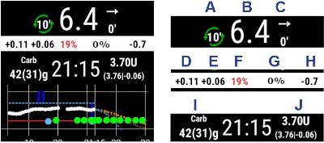

# Smartwatch-Integration

AndroidAPS kann mit einer Android Wear Smartwatch *gesteuert* werden. Wenn du Boli etc. von der Smartwatch aus abgeben willst, aktiviere "Steuerung durch die Uhr".

Die nachfolgenden Funktionen kannst Du von der Uhr aus starten:

* temporäres Ziel setzen
* Bolus abgeben
* Bolusrechner verwenden (Welche Variablen bei der Berechnung berücksichtigt werden, lässt sich in den [Einstellungen](../Configuration/Config-Builder.md?highlight=tdd#wear) auf dem Smartphone festlegen.)
* Loop- und Pumpenstatus prüfen
* TDD (Total daily dose = Bolus + Basal pro Tag) anzeigen

Dafür musst du beim [Erstellen der APK](../Installing-AndroidAPS/Building-APK.md) die Build Variante "fullRelease" auswählen (alternativ erlaubt "pumpRelease" die Fernsteuerung der Pumpe ohne loopen). Im Konfigurations-Generator von AAPS musst du [Wear erlauben](../Configuration/Config-Builder#wear).

Es gibt mehrere Ziffernblätter zur Auswahl, die das durchschnittliche Delta, IOB, die derzeit aktive TBR und Basalraten sowie die Kurve der CGM-Werte anzeigen können.

Stelle sicher, dass AndroidAPS die Erlaubnis hat, Benachrichtigungen auf der Uhr anzuzeigen. Die Eingaben werden aktiviert, indem man die Benachrichtigung auf der Uhr öffnet, einmal wischt und bestätigt.

Um schneller zu AndroidAPS zu kommen, kannst du den angezeigten CGM-Wert auf der Uhr doppelt anklicken. Klicke doppelt auf die BZ-Kurve um den Zeitraum zu ändern.

## Fehlerbehebung der Smartwatch App:

* In Android Wear 2.0 installiert sich das Watchface nicht von alleine. Du musst in den Playstore der Uhr (unterscheidet sich vom Playstore des Smartphones!) gehen und unter der Kategorie “installierte Apps auf dem Handy” AAPS aktivieren. Aktiviere ebenalls Auto Update. 
* Manchmal hilft es, Apps erneut mit der Uhr zu synchronisieren, da es manchmal ein bisschen langsam sein kann, bis der Sync automatisch erfolgt: Wear Os > Zahnrad-Symbol (ganz unten) > Name deiner Uhr > Apps erneut synchronisieren.
* Schalte ADB Debuggen in den Entwickleroptionen der Uhr ein, verbinde die Uhr via USB mit dem PC und starte die Wear App einmal in Android Studio.

## Legende AndroidAPSv2 watchface

A - Zeit seit der letzten Loop-Aktivität

B - CGM Wert

C - Minuten seit dem letzten CGM-Wert

D - Veränderung zwischen letztem und vorletztem CGM-Wert (in mmol oder mg/dl)

E - Durchschnittliche Änderung der CGM-Werte in den letzten 15 Minuten

F - Batteriestatus des Smartphones

G - Basalrate (Anzeige in IE/Std. bei Standard-BR und in % während einer TBR)

H - BGI (blood glucose interaction) -> erwartete BZ-Änderung allein auf Basis des aktiven Insulins.

I - Kohlenhydrate (carbs on board | e-carbs in der Zukunft)

J - Insulin on board (aus Boli | aus Basal)

## Nightscout Daten anzeigen

Falls du ein anderes System zum loopen verwendest und deine Daten oder die deines Kindes/Verwandten auf der Uhr *sehen* möchtest, kannst du auch einfach nur die Watch APK kompilieren. Wähle dazu in Android Studio die Build Variante “nsclient”. Gehe wie unter [AndroidAPS installieren - App erstellen](../Installing-AndroidAPS/Building-APK.md) beschrieben vor und wähle die Build Variante "NSClientRelease". Es gibt mehrere Ziffernblätter zur Auswahl, die das durchschnittliche Delta, IOB, die derzeit aktive TBR und Basalraten sowie die Kurve der CGM-Werte anzeigen können.

## Pebble

Pebble Nutzer können das [Urchin watchface](https://github.com/mddub/urchin-cgm) nutzen um ihre Loop-Daten zu *sehen*. Mit dieser Methode ist es aber nicht möglich, die Pumpe und AndroidAPS zu steuern. Du kannst Felder wählen, um z. B. IOB, aktiver temp. Basalrate und Vorhersage anzeigen zu lassen. Falls du open loopst, kannst du [IFTTT](https://ifttt.com/) benutzen, um ein kleines Programm zu erstellen, welches (wenn eine Benachrichtigung von AndroidAPS kommt) eine SMS oder Benachrichtigung anzeigt.