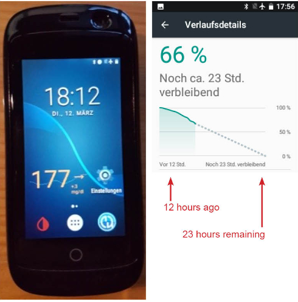
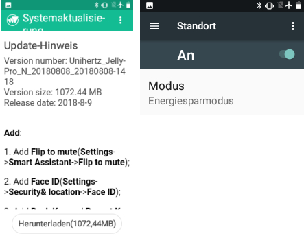
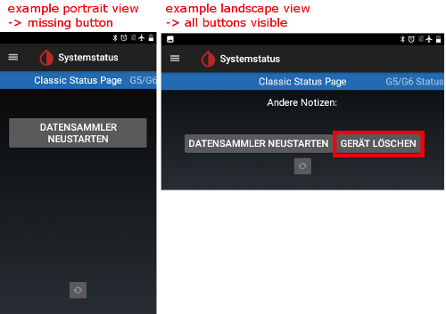
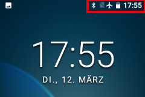

# Jelly Pro

## Vor- und Nachteile

### Vorteile Jelly Pro

* Es ist wirklich klein.
* Selbst wenn Du Leutene erklärst, werden es manche Menschen nicht als normales Smartphone ansehen und vielleicht eher in Bereichen, in denen keine Smartphones erlaubt sind, akzeptieren.

### Nachteile Jelly Pro

* Nur für erfahrene Looper zu empfehlen (Manche Einstellungen sind nicht zu erkennen, man muss aus Erfahrungen mit einem großen Android-AAS-Phone wissen, wie und wo was steht. Manche AAPS Buttons kann man mit viel Gefühl nur schwer antippen, mit Wurstfingern gar nicht.)
* Nur als Loop-Phone zu nutzen. In wessen Hosentasche ein normales Android passt, ist damit besser beraten. 
* Wenn man es nicht wie eine Diva behandelt (Immer (!) bei sich trägt!) zeigt es seine zickige Seite, entkoppelt alle Bluetooth-Verbindungen und schmollt bis zum Neustart. 

## Jelly Pro - Optimierung der Batterielaufzeit

Mit den nachfolgend beschriebenen Einstellungen und Handhabung (u.a. Nutzung der Smartwatch statt des Jelly Pro für die Behandlungen im Alltag) sind ca. 35 Stunden Akkulaufzeit möglich. Ein zusätzlicher Batteriesparmodus ist nicht nötig, eher kontraproduktiv, also aus lassen.

### Ersteinrichtung

<b>Sehr wichtig:</b> Wenn Du Android 8.1 nicht benötigst (z.B. um mit einer Accu-Check Combo zu loopen) bleibe bei Android 7.0!

Gehe wie folgt vor, um bei Android 7.0 zu bleiben:

* Beim ersten Einschalten unbedingt eine Verbindung mit dem WLAN oder dem mobilen Netz unterbinden, um ein ungewolltes Auto-Update zu vermeiden.
* Überspringe die Einrichtung des WLAN.
* Die Offline-Einrichtung des Google-Kontos ist das einzige, was nicht übersprungen werden kann.
* Wechsle in die Einstellungen und deaktiviere Auto-Update (Settings >System >About the phone >System update >Three-point menu top right >Settings >Automatically check for updates >Once).
* Jedes Mal, wenn Du WLAN oder das Mobilfunknetz aktivierst, wirst Du benachrichtigt, dass ein Systemupdate verfügbar ist. Nicht aktualisieren! Es empfiehlt sich, die Meldung zu löschen, so dass Du nicht versehentlich aktualisierst. Ein Update wäre nicht so einfach rückgängig zu machen. 
* Installierte Apps können und sollten aktualisiert werden.

### Einstellungen

* Verwende das Jelly nur zum Loopen.
* Aktiviere WLAN nur, um xDrip, AAPS und WearOS zu installieren. Ansonsten bleibt das WLAN aus. 
* WLAN kann kurzzeitig aktiviert werden, um Daten zu Nightscout hochzuladen.
* Das Jelly benötigt keine SIM-Karte. Wenn Du eine verwendest, stelle sicher, dass mobile Daten deaktiviert sind. Am einfachsten ist es, den Flugmodus zu aktivieren.
* Auch wenn Du keine SIM-Karte verwendest, solltest Du die mobilen Daten deaktivieren.
* Bluetooth muss natürlich aktiviert werden. Wenn die Pumpe längere Zeit außer Reichweite ist, verbraucht die "Suche" eine Menge Batterie.
* DURASPEED AN (Settings > Device > Duraspeed on). Setze AAPS, WearOS und xDrip+ auf die Whitelist, damit diese im Hintergrund laufen können. Alle anderen Apps sollten nicht im Hintergrund laufen.
* Beende alle anderen Dienste und Apps im Hintergrund. Settings > Intelligent assistant > Exit tasks in background > Disable all other apps (despite AAPS, WearOS and xDrip+).
* Standortdienste müssen aktiviert sein, aber im Energiesparmodus (Settings > User > Location > Mode > Energy Saver Mode).
* Bildschirmhelligkeit auf 0%, Bildschirm aus (sleep) nach 15-30 Sek. (Settings > Device > Display).
* Behandlungen im Alltag nur über die Smartwatch. Andere Einstellungen und Anzeige nur während des Ladevorgangs. 
* Das Jelly bleibt wie die Pumpe den ganzen Tag über in der Tasche / unter der Kleidung ohne genutzt zu werden.

## Tipps

* Der Jelly ist ein nicht immer intuitiv zu bedienen und verhält sich manchmal wie ein Baby-Diva. Ein Neustart (Knopf rechts) hin und wieder kann eine gute Idee sein.
* Im Hochformat werden evtl. nicht alle Buttons angezeigt. Daher lohnt es sich auszuprobieren, ob nach einer 90º Drehung im Querformat mehr Bedienelemente zu sehen sind.

* Die Kopfzeile des Homescreens hat rechts insgesamt 6 Belegplätze. Die Uhr braucht 2 davon. Sollten 5 davon belegt sein (z.B. durch Bluetooth, nicht stören, keine SIM-Karte, Flugmodus und die Akkuanzeige) wird keine Uhr angezeigt. Man kann mit dem Button links oben kurz die Laustärke erhöhen, dann erscheint die Uhr in der Kopfzeile. ;-)
* Der "Wecker", der anfangs mit Werkeinstellungen unter der Uhrzeit auf dem Homescreen angezeigt wird, ist wohl eine zweite Zeitzone. Diese ausschalten, da AAPS darauf zugreifen würde (Einstellungen >System >Datum&Uhrzeit > Automatische Zeitzone >AUS). Stattdessen die vom Netzwerk bereitgestellte Zeit nutzen.
* Einen Screenshot macht man, indem man den leise-Button (links unten) + den An-Button (rechts) gleichzeitig drückt. 

