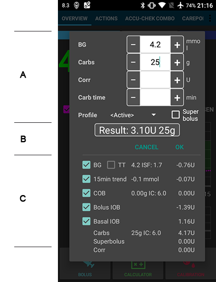
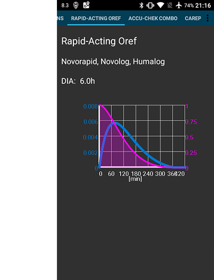
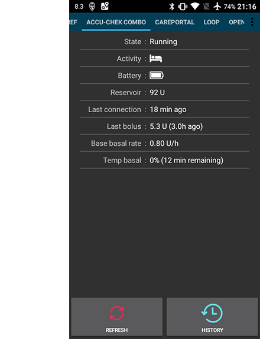
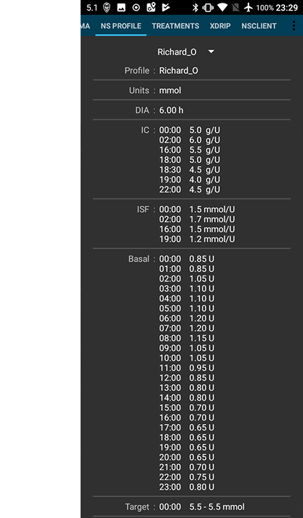

# Screenshots

## Overzicht-scherm

Dit is het eerste scherm dat je ziet wanneer je AndroidAPS opent en je vindt er de meeste dingen die je dagelijks nodig hebt.

**Sectie A:** Hiermee kun je navigeren tussen de verschillende AndroidAPS modules, door naar links of rechts te vegen.

**Sectie B:** Hier zie je de status van de loop, die je hier ook kunt veranderen (de closed loop deactiveren, onderbreken etc). Je huidige profiel is zichtbaar en jouw streefdoel. Je kunt hier ook een (tijdelijke) profielswitch en tijdelijk streefdoel instellen. Aanpassingen maak je door een veld lang ingedrukt te houden. Houd bijvoorbeeld de grijze knop rechtsboven met streefdoel ("110" in screenshot) lang ingedrukt om een tijdelijk streefdoel in te stellen.

**Sectie C:** Hier zie je de laatste glucosewaarde van jouw CGM, en hoe lang geleden deze gemeten was. Ook de verandering in de afgelopen 15 en 40 minuten, jouw actuele basaalstand - inclusief eventuele tijdelijke basaalstand (TBR, temporary basal rate), de nog werkzame insuline (IOB, insulin on board) en hoeveelheid koolhydraten (COB, carbs on board).

De optionele [statusindicatoren](../Configuration/Preferences.md) (CAN | INS | RES | SEN | BAT) geeft een visuele waarschuwing voor laag reservoir, batterij bijna leeg, en infuuswissel.

De nog werkzame insuline (IOB) staat op nul als de loop in de afgelopen tijd jouw ingestelde basaalstand heeft afgegeven en er geen insuline meer over is van een eerdere bolus. De getallen binnen de haakjes is hoeveel insuline er nog werkzaam is van een eerdere bolus, en hoeveel verschil er zit tussen de door jou ingestelde basaalstanden en de tijdelijke basaalstanden (TBRs, temporary basal rates) die AndroidAPS heeft gegeven. Dat tweede getal zal negatief zijn, als je afgelopen tijd lagere tijdelijke basaalstanden hebt gehad.

**Sectie D:** Klik op de pijl aan de rechterkant van het scherm in sectie D om te selecteren welke informatie je wilt zien op de grafieken eronder.

**Sectie E:** De grafiek met jouw bloedglucosewaardes (BG) van jouw sensor. Je ziet ook notificaties van bijvoorbeld calibraties en ingevoerde koolhydraten. Houd de grafiek lang ingedrukt om de tijdsduur aan te passen. Je kunt kiezen om de afgelopen 6, 8, 12, 18 of 24 uur te laten zien.

De verlengde lijnen zijn de voorspelde BG waardes en trends - wanneer je die hebt aangevinkt.

* Orange line: COB (colour is used generally to represent COB and carbs)
* Dark blue line: IOB (colour is used generally to represent IOB and insulin)
* Light blue line: zero-temp
* Dark yellow line: UAM

Deze lijnen laten voorspellingen zien aan de hand van verschillende scenario's. Eentje waarbij rekening wordt gehouden met de huidige absorptie van koolhydraten (COB). Eentje waarbij alleen met insuline rekening wordt gehouden (IOB). Eentje die laat zien wat er gebeurt als er vanaf nu een tijdelijke basaalstand van nul (zero-temp) wordt gegeven zonder verder rekening te houden met BG afwijkingen. En eentje waarbij het systeem een BG stijging heeft opgemerkt en ervan uitgaat dat je koolhydraten hebt gegeten zonder die ingevoerd te hebben (UAM, unannounced meal).

De grafiek eronder, met de blauwe lijnen zijn de basaalstanden. De blauwe stippellijn is de basaal die jij zelf had ingesteld, zonder tijdelijke basaalstanden (TBRs) van AndroidAPS. De ononderbroken blauwe lijn is de basaal die de pomp heeft afgegeven (en dus inclusief eventuele TBRs).

**Sectie F:** De weergave kun je aanpassen met de opties uit sectie D. In dit screenshot zie je de insuline aan boord (IOB), de gevoeligheid en de afwijkingen. GRIJZE balken zijn een afwijking door koolhydraten. GROEN is wanneer de BG hoger is dan het algoritme verwacht, en ROOD is wanneer de BG lager is dan het algoritme verwacht.

**Sectie G:** Met deze knoppen kun je een bolus geven (zonder de calculator te gebruiken), de boluscalculator gebruiken, of een BG calibratie (met vingerprik) toevoegen.

## Boluscalcuator

Wanneer je wilt bolussen voor een maaltijd, dan doe je dat meestal via dit scherm.

**Sectie A:** Hier voer je de gegevens in die de boluscalculator zal gebruiken. Het BG veld is normaalgesproken al ingevuld, dit is jouw meest recente CGM waarde. Wanneer jouw CGM het niet doet, dan is dit veld leeg. In het Koolhydraten veld voer je de hoeveelheid koolhydraten (in grammen) in die je wilt gaan eten. NB: Wanneer je gewend bent om 'broodwaarden' oid te gebruiken, zul je dus eerst naar grammen moeten omrekenen. Het Correctie veld kun je gebruiken als je om wat voor reden dan ook de einddosis wilt aanpassen. In het KH tijdsduur veld kun je een pre-bolus tijd invoeren, dwz dat er tijd tussen bolussen en eten zit. Je kunt ook een negatieve waarde in dit veld invullen als je bolust na je maaltijd.

Bij een SUPER BOLUS wordt de basale insuline voor de komende twee uur toegevoegd aan de maaltijdbolus, gevolgd door een tijdelijke basaalstand van nul voor de komende twee uur om te compenseren voor de extra insuline. Hiermee wordt de insuline 'naar voren gehaald', zodat je een minder hoge glucosepiek zult hebben na de maaltijd.

**Sectie B:** toont de berekende bolus. Wanneer je al meer insuline aan boord (IOB) hebt dan de berekende bolus, dan zal hier alleen de ontbrekende hoeveelheid koolhydraten te zien zijn.

**Sectie C:** hier zie je de verschillende variabelen die zijn gebruikt voor het berekenen van de bolus. Je kunt variabelen uitschakelen die je niet wilt laten meenemen in de berekening, maar meestal zul je hier niets van aanpassen.

### Combinations of COB and IOB and what they mean

<ul>
    <li>If you tick COB and IOB unabsorbed carbs that are not already covered with insulin + all insulin that has been delivered as TBR or SMB will be taken into account</li>
    <li>If you tick COB without IOB you run the risk of too much insulin as AAPS is not accounting for what’s already given. </li>
    <li>If you tick IOB without COB, AAPS takes account of already delivered insulin but won’t cover that off against any carbs still to be absorbed. This leads to a 'missing carbs' notice.
</ul>

If you bolus for additional food shortly after a meal bolus (i.e. additional desert) it can be helpful to untick all boxes. This way just the new carbs are being added as the main meal won't necessarily be absorbed so IOB won't match COB accurately shortly after a meal bolus.

### Slow carb absorption

As of version 2.4, AAPS warns if slow carb absorption is detected. There will be an additional text on the confirmation screen after calculator usage. The risk is that COB would be overestimated and to much insulin might be given.

In this example 41% of time [min_5m_carbimpact](..//Configuration/Config-Builder.html?highlight=min_5m_carbimpact#absorption-settings) was used instead of value calculated from deviations.

In this case you should think about pressing "Cancel" and calculate again with COB unticked. If from your manual calculation you see the need for a correction bolus enter it manually. But be careful not to overdose!

## Insuline curve

This shows the activity profile of the insulin you have chosen. The PURPLE line shows how much insulin remains after it has been injected as it decays with time and the BLUE line shows how active it is.

You will normally be using one of the Oref profiles - and the important thing to note is that the decay has a long tail. If you have been used to manual pumping you have probably been used to assuming that insulin decays over about 3.5 hours. However, when you are looping the long tail matters as the calculations are far more precise and these small amounts add up when they are subjected to the recursive calculations in the AndroidAPS algorithm.

For a more detailed discussion of the different types of insulin, their activity profiles and why all this matters you can read an article here on [Understanding the New IOB Curves Based on Exponential Activity Curves](https://openaps.readthedocs.io/en/latest/docs/While%20You%20Wait%20For%20Gear/understanding-insulin-on-board-calculations.html#understanding-the-new-iob-curves-based-on-exponential-activity-curves)

And you can read an excellent blog article about it here: [Why we are regularly wrong in the duration of insulin action (DIA) times we use, and why it matters…](http://www.diabettech.com/insulin/why-we-are-regularly-wrong-in-the-duration-of-insulin-action-dia-times-we-use-and-why-it-matters/)

And more at: [Exponential Insulin Curves + Fiasp](http://seemycgm.com/2017/10/21/exponential-insulin-curves-fiasp/)

## Pompstatus

Here we see the status of the insulin pump - in this case an Accu-Chek Combo. The information displayed is self explanatory. A long press on the HISTORY button will read the data from your pump history, including your basal profile. But remember only one basal profile is supported on the Combo pump.

## Care Portal

This replicates the functions you will find on your Nightscout screen under the "+" symbol which allows you to add notes to your records. Functions such as recording when you change a pump site, or insulin cartridge should be self explanatory. BUT this section does not issue any commands to your pump. So if you add a bolus using this screen it simply makes a note of this on your Nightscout record, the pump won't be instructed to deliver a bolus.

## Loop, MA, AMA, SMB

You don't normally need to worry about these, they show the results of the OpenAPS algorithm which runs each time the system gets a fresh reading from the CGM. These are discussed elsewhere.

## Profiel

AndroidAPS can run using a number of different profile configuratons. Typically - as shown here - the Nightscout profile has been downloaded via the built in Nighscout client and is displayed here in read-only form. If you wanted to make any changes you would do this from your Nightscout user interface and then do a "Switch Profile" on your AndroidAPS rig to refresh the download. Data such as the basal profile would then be automatically copied over to your pump.

**DIA:** stands for Duration of Insulin Action and it is discussed above in the section on insulin profiles.

**IC:** is Insulin to Carb ratio. This profile has a number of different values set for different times of day.

**ISF:** is Insulin Sensitivity Factor - the amount by which one unit of insulin will reduce your blood glucose assuming that nothing else changes.

**Basal:** is the basal profile programmed into your pump.

**Target:** is the blood glucose level that you want the rig to be aiming for all the time. You can set different levels for differenttimes of day if you wish, and you can even set an upper and lower range so that the rig will only start to make changes when the predicted blood glucose value falls outside, but if you do that then the rig will respond more slowly and you are unlikely to achieve such stable blood sugars.

## Behandelingen, xDrip, NSClient

These are simply logs of treatments (boluses and carbs), xDrip messages and messages sent to Nightscout via the built-in Nightscout client. You don't normally need to worry about any of these unless there is a problem.

## Configurator

This is where you will set up the configuraton of your AndroidAPS rig. This screenshot shows a pretty typical rig using a Combo pump, a Dexcom G5 CGM sensor being managed via xDrip+ and running with NovoRapid insulin on an Oref profile and connected to a Nightscout cloud based server.

The tick box on the right determines if that particular module will be displayed in the top menu bar (see section A at Homescreen) and the small gear wheel symbol allows access to the setting for that module, if there are any.

## Instellingen en voorkeuren

At the top right of the navigation bar you will find three small vertical dots. Pressing on these takes you to the app's preferences, history browser, setup wizard, about the app information and the exit button that will close AAPS.