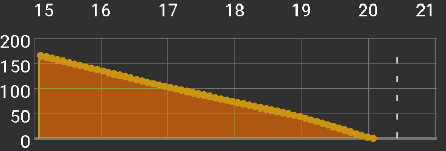

# Определение чувствительности

## Алгоритм чувствительности

В настоящее время есть 4 модели определения чувствительности:

* Чувствительность Oref0
* Чувствительность AAPS
* Средневзвешенная чувствительность
* Чувствительность Oref1

### Чувствительность Oref0

Чувствительность рассчитывается на основе данных за прошедшие 24 часа а (неусвоенные) углеводы не учитываются после времени указанного в настройках. Алгоритм похож на OpenAPS Oref0, описанный в документации [OpenAPS Oref0](https://openaps.readthedocs.io/en/2017-05-21/docs/walkthrough/phase-4/advanced-features.html).

### Чувствительность AAPS

Чувствительность вычисляется таким же образом, как Oref0, но вы можете указать и время в прошлом. Минимальное усвоение углеводов рассчитывается из максимального времени поглощения углеводов в настройках

### Средневзвешенная чувствительность

Чувствительность рассчитывается как средневзвешанная от отклонений. Новые отклонения имеют большее значение. Минимальное усвоение углеводов рассчитывается из максимального времени поглощения углеводов в настройках. Этот алгоритм является самым быстрым при отслеживании изменений чувствительности.

### Чувствительность Oref1

Чувствительность рассчитывается на основе данных за прошедшие 8 часов или с последней смены катетера, если это меньше 8 часов назад. Углеводы (не усвоенные) не учитываются по прошествии времени, указанного в настройках. Только алгоритм Oref1 поддерживает непредвиденный прием пищи (UAM). Это означает, что время с распознанным непредвиденным приемом пищи UAM исключено из расчета чувствительности. Поэтому если вы используете супермикроболюс SMB с непредвиденным приемом пищи UAM, вам необходимо выбрать алгоритм Oref1 для правильной работы. Для получения дополнительной информации читайте документацию [OpenAPS Oref1](https://openaps.readthedocs.io/en/latest/docs/Customize-Iterate/autosens.html).

## Одновременный учет углеводов

Существует значительное отличие при учете средневзвешенного количества углеводов в AAPS по сравнению с Oref0 или Oref1. Компоненты Oref принимают в расчет усвоение углеводов только от однократного приема пищи. Это означает, что второй прием пищи начинает учитываться только после полного усвоения первого. AAPS + средневзвешенные углеводы начинают учет сразу же после ввода углеводов. Если имеет место более одного приема пищи, то минимальный расход углеводов рассчитываться в зависимости от объема еды и максимального времени усвоения. Соответственно, минимальное усвоение будет выше в сравнении с надстройками Oref.

## Примеры с активными углеводами COB

Oref0 / Oref1 - неусвоенные углеводы отбрасываются после установленного времени

Средневзвешенное усвоение AAPS рассчитывается исходя из `COB == 0` после установленного времени

Если используется минимальное усвоение углеводов вместо значения, рассчитанного на основе отклонений, на графике активных углеводов COB появится оранжевая точка