# Обновление до новой версии или ветки

<font color="#FF0000"><b>Важное замечание: Начиная с версии 2.3 следует использовать git для обновления. Обновление с zip-файла больше не работает.</font></b>.

***Примечание***: Обновляясь до AndroidAPS 2.3, рекомендуется использовать версию [Android Studio 3.4](https://developer.android.com/studio/archive?), т. к. с последней версией не работает.

## Установите git (если у вас его нет)

### Windows

* Любая версия git должна работать. Например <https://git-scm.com/download/win>
* Убедитесь, что знаете путь установки. Он понадобится на следующем шаге.
  
  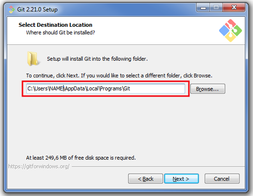

* Укажите Studio, где находится git.exe: Файл - Настройки
  
  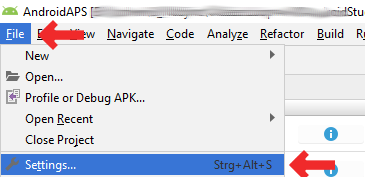

* В следующем окне: Управление версиями - Git

* Выберите правильный путь: .../Git<font color="#FF0000"><b>/bin</b></font>

* Убедитесь, что выбран метод обновления "Объединение".
  
  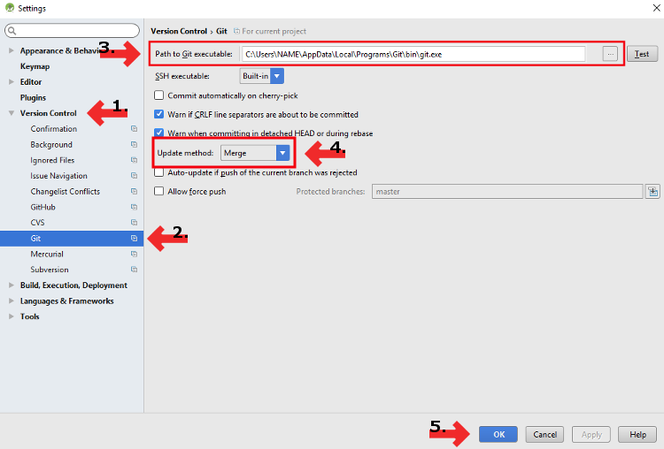

### Mac

* Любая версия git должна работать. Например <https://git-scm.com/download/mac>
* Используйте homebrew для установки git: ```$ brew install git```.
* Подробности об установке git см. в [официальной git документации](https://git-scm.com/book/en/v2/Getting-Started-Installing-Git).
* Если вы устанавливаете git через homebrew, то нет необходимости изменять какие-либо настройки. На всякий случай: Их можно найти здесь: Android Studio - Настройки.

## Обновите свою локальную копию

* Нажмите: VCS->Git->Fetch
  
  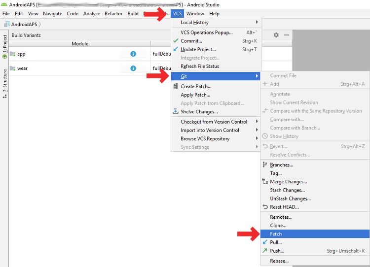

## Выберите ветку

* Если вы хотите изменить ветку, выберите другую ветку из выпадающего меню: master (latest release) или другую версию (см. ниже)
  
  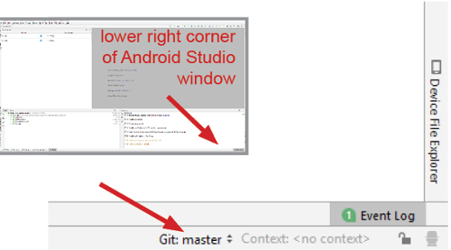

и затем выход (или 'выход через новую ветку', если просто 'выход' недоступен.)

     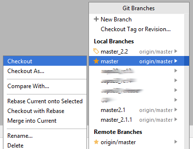
    

## Обновление ветки из Github

* Нажмите Ctrl+T, выберите способ слияния и нажмите OK
  
  

В трее вы увидите зеленое сообщение о обновленном проекте

## Создание подписанного APK

<!--- Text is maintained in page building-apk.md ---> В меню выберите "Build"(выполнить сборку) и затем "Generate Signed Bundle / APK..."(создать подписанный пакет программ). (Меню в Android Studio изменилось с сентября 2018 года. В более старых версиях выберите в меню «выполнить сборку» и «Генерировать подписанный APK...».)

  
Подписание означает, что вы подписываете ваше сгенерированное приложение цифровой подписью. Это необходимо потому, что Android имеет правило, согласно которому принимается только подписанный код для запуска по соображениям безопасности. Для получения дополнительной информации по этой теме перейдите по ссылке [здесь](https://developer.android.com/studio/publish/app-signing.html#generate-key). Безопасность - это глубокая и сложная тема, нам она сейчас не нужна.

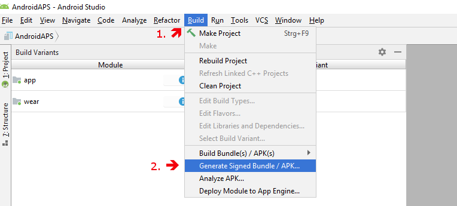

В следующем диалоговом окне выберите "APK" вместо "Android App Bundle" и нажмите кнопку "Далее".

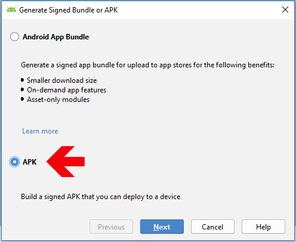

Выберите "app" (приложение) и нажмите "Next" (далее).


Введите путь к магазину ключей, введите пароль для магазина ключей, выберите название ключа и введите пароль на ключ.

Выберите «Запомнить пароли».

Затем нажмите "Далее".

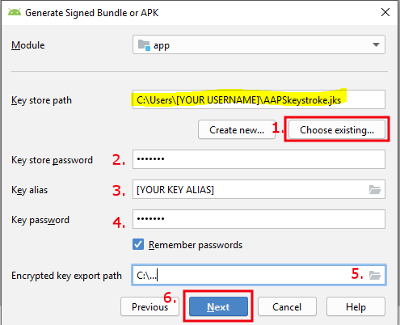

Выберите "full" (полный) в качестве атрибута для сгенерированного приложения. Выберите V1 "Jar Signature" (V2 необязательно) и нажмите "Finish" (закончить). В дальнейшем может пригодиться следующая информация.

* 'Release' должен быть вашим выбором по умолчанию для "Build Type"(типа сборки), 'Debug' только для программистов.
* Выберите тип сборки, который хотите создать. 
  * полный (с автоматически принимаемыми рекомендациями в закрытом цикле)
  * открытый цикл (рекомендации, адресованные пользователю, выполняются вручную)
  * управление помпой (дистанционное управление помпой, без функционирования цикла)
  * nsclient (например, отображаются данные другого пользователя, могут добавляться записи портала лечения/назначений)


В журнале событий вы увидите, что подписанное приложение (APK) было создано успешно.


Нажмите на ссылку "Найти" в журнале событий.


## Перенос приложения на смартфон

<!--- Text is maintained in page building-apk.md ---> Открывается окно файлового менеджера. Может выглядеть немного иначе в вашей системе, поскольку я использую Linux. В Windows это будет File Explorer (проводник), а на Mac OS X Finder (поисковик). Там вы увидите каталог с созданным APK файлом. К сожалению, это неверное место, так как "wear-release.apk" не является подписанным приложением, которое мы ищем.


Перейдите к папке AndroidAPS/app/full/release, чтобы найти файл "app-full-release.apk". Перенесите этот файл на смартфон Android. Вы можете сделать это по-своему, напр. загрузкой в облако, переносом с компьютера по кабелю или используя электронную почту. В этом примере я использую Gmail, так как для меня такой перенос привычнее. Для установки на нашем смартфоне следует дать системе Android разрешение сделать установку из Gmail, которая обычно запрещена. Если переносите установщик другим способом, поступите соответственно.


В настройках смартфона есть область "установка неизвестных приложений" где я даю Gmail право устанавливать APK файлы, которые я получаю через Gmail.

Выберите "Разрешить из этого источника". После установки вы можете отключить его снова.

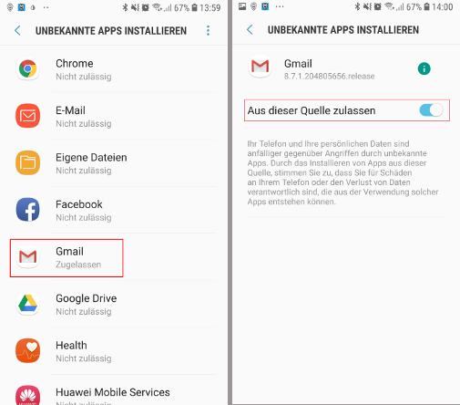

Последний шаг - нажать на файл APK, который я получил через Gmail и установить приложение. Если APK не установливается и у вас более старая версия AndroidAPS на телефоне, подписанная другим ключом, то нужно сначала удалить более старое приложение; при этом не забудьте экспортировать ваши настройки!

Да, все получилось, теперь можно начать настройку AndroidAPS (CGMS, помпа) и т. д.

## Проверить версию AAPS на телефоне

Версию AAPS можно проверить, нажав на меню из трех точек сверху справа "о приложении".


# Устранение неполадок

## Предупреждение компилятора Kotlin

Если сборка завершена успешно, но вы получаете предупреждения компилятора Kotlin, просто проигнорируйте эти предупреждения.

Приложение успешно построено и может быть перенесено на телефон.

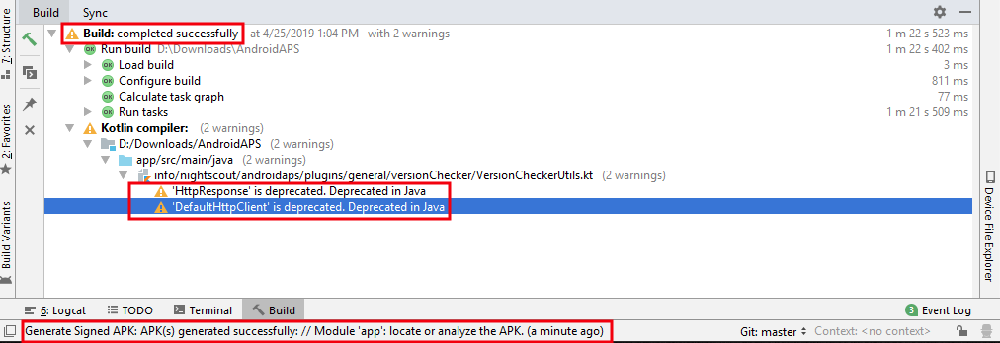

## Не удалось загрузить… / Работа оффлайн

Если вы получите такое сообщение об ошибке


убедитесь, что «работа оффлайн» отключена.

Файл -> параметры


## Неодобренные изменения

Если вы получите такое сообщение об ошибке:

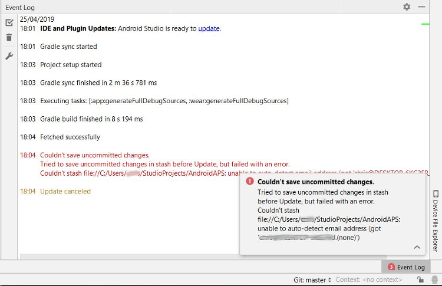

### Вариант 1

* В Android Studio выберите VCS -> GIT -> Сбросить HEAD 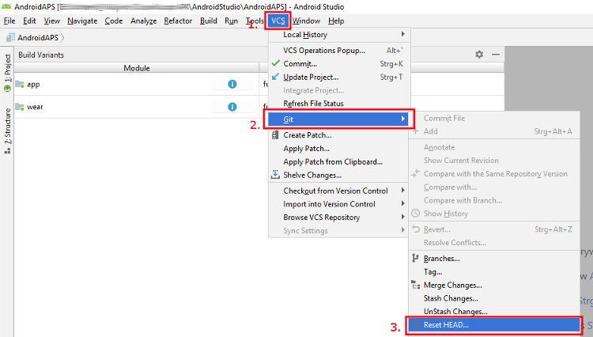

### Вариант 2

* Скопируйте «git checkout --» в буфер обмена (без кавычек)
* Переключитесь на терминал в Android Studio (слева с нижней стороны окна Android Studio) 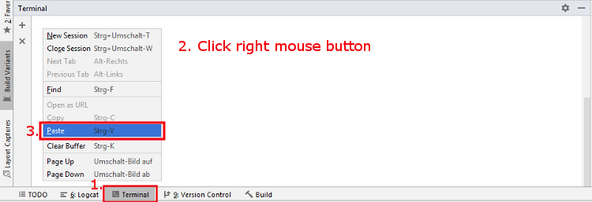

* Вставьте скопированный текст и нажмите ввод 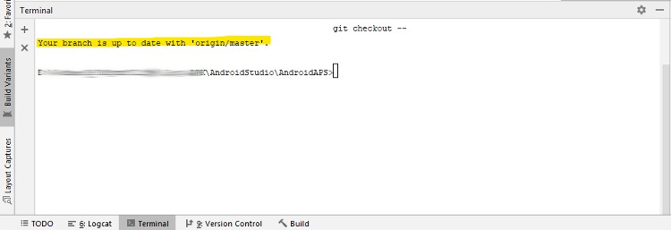

## Приложение не установлено


* Убедитесь, что вы передали файл «full-release.apk» на ваш телефон.
* Если на вашем телефоне появилось сообщение "приложение не установлено", то выполните следующее: 
  1. [Экспорт настроек](../Usage/Objectives#export-import-settings) (уже установленной на телефоне версии AAPS)
  2. Удалите AAPS с телефона.
  3. Включите режим самолета & выключить bluetooth.
  4. Установите новую версию («app-full-release.apk»)
  5. [Выполните импорт настроек](../Usage/Objectives#export-import-settings)
  6. Снова включите Bluetooth и отключите режим самолета

## Приложение установлено, но старая версия

Если вы успешно построили приложение, передали его на ваш телефон и установили его, но номер версии остается прежним, то вы могли пропустить шаг слияния в [инструкции по обновлению](../Installing-AndroidAPS/Update-to-new-version#updating-branch-from-github).

## Ничего из вышеперечисленного не сработало

Если вышеперечисленные советы не помогли попробуйте заново начать сборку приложения:

1. [Экспорт настроек](../Usage/Objectives#export-import-settings) (уже установленной на телефоне версии AAPS)
2. Приготовьте пароль ключа и пароль для хранения ключа Если вы забыли пароли, вы можете найти их в файлах проекта, как описано [здесь](https://youtu.be/nS3wxnLgZOo).
3.     Запомните путь к месту хранения ключа
      в Android Studio Build -> Генерировать подписанный APK
      
      
  
  4. Постройте приложение с нуля, как описано [здесь](../Installing-AndroidAPS/Building-APK#download-code-and-additional-components). Используйте существующий ключ и место хранения ключей.
4. Когда вы успешно собрали APK, удалите существующее приложение с телефона, перенесите новое приложение на ваш телефон и установите.
5. [Выполните импорт настроек](../Usage/Objectives#export-import-settings)

## Сценарий худшего варианта

Если даже создание приложения с нуля не решает проблему, попробуйте полностью удалить Android Studio. Некоторые пользователи сообщили, что это решило проблему.

Убедитесь, что удалены все файлы, связанные с Android Studio. Руководство можно найти в сети: <https://stackoverflow.com/questions/39953495/how-to-completely-uninstall-android-studio-from-windowsv10>.

Установите Android Studio с нуля, как описано [здесь](../Installing-AndroidAPS/Building-APK#install-android-studio) и **не обновляйте gradle**.